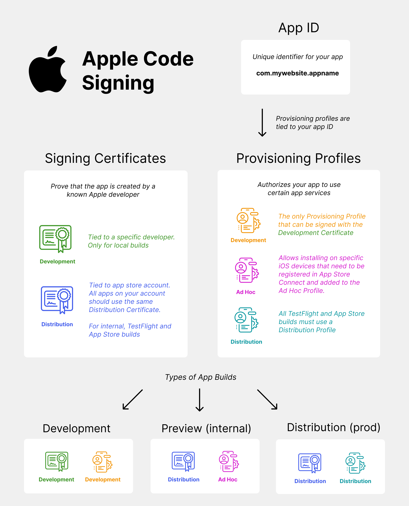

# React Native - Expo Setup

## Create a New Expo App

```bash
npx create-expo-app appName --template
```

# Libraries Installation (at least used in this project) 

npx expo install expo-router react-native-safe-area-context react-native-screens expo-linking expo-constants expo-status-bar
npx expo install -- --save-dev prettier eslint-config-prettier eslint-plugin-prettier
npx expo install expo-notifications expo-device
npx expo install @expo/vector-icons
npx expo install zustand
npx expo install @react-native-async-storage/async-storage
npx expo install expo-haptics
npx expo install date-fns
npx expo install expo-linear-gradient
npx expo install expo-image-picker
npx expo install expo-file-system
npx expo install expo-dev-client
npx expo install expo-font @expo-google-fonts/caveat
npx expo install expo-quick-actions
npx expo install react-native-web react-dom (optional)

## Scheme

Add the scheme to your app.json:

```bash
{
  "scheme": "appName"
}
```

## Optional Web

In the web section of app.json:

```bash
{
  "web": {
    "favicon": "./assets/favicon.png",
    "bundler": "metro"
  }
}
```

# Deployment

npx expo prebuild --platform ios
npx expo prebuild --platform android
npx expo prebuild --platform ios --clean 
# or
npx expo prebuild --platform android --clean 
npx expo run:ios
# or
npx expo run:android

# Linting

```bash
npx expo lint
```

# Using EAS

```bash
npm i -g eas-cli
eas init
eas build:configure
# Select "all" when prompted
```

# Tools

Use Expo Orbit for installing API/APK.

Linking from react-native is for debugging where deep links came from

# Build signing
In order for any app to be installable on a physical device, it needs to be signed. Build signing is a security mechanism and its purpose is to protect users by preventing them from installing potentially malicious apps.

Both iOS and Android apps have a build signing step, though the process is completely different.

## Android
On Android, builds are signed with an Android Keystore. The keystore can be created on Mac, Windows or Linux.

Open android/app/build.gradle in you'll see that our app already comes with a debug keystore (android/app/debug.keystore) which is used for the debug build.

For the release build, you'll need an upload keystore (it is they keystore Google will use to validate the upload), and Google will manage the production keystore for you.

## iOS
iOS build signing is incredibly complicated and much more restrictive than Android. There are three types of builds on iOS: Development, Ad Hoc and Production, and each build has a Provisioning Profile and a Signing Certificate.

Here's a chart to explain which certificates are used together:



# Development
This is a debug build that is directly installable on device. It requires an Development Provisioning Profile and a Development signing certificate.

The only way to create this build is via Xcode:

1. plug your iPhone into your Mac
2. open your iOS project Xcode (open Xcode -> open existing project -> choose the ios folder of your project)
3. open signing & capabilities and log into your apple ID (doesn't need to be a dev account)
4. choose "Your Name's Personal Team"
5. make sure your phone is the selected target and build from Xcode
6. you'll be prompted to open settings and "approve" this developer
7. This is the only way to do an iOS build on a device without an Apple Developer account.

# Ad Hoc
The Ad Hoc build is a non-development build that's installable on a real device without going through the App Store. It requires an Ad Hoc Provisioning Profile and a Distribution signing certificate. You must have an Apple Developer account to create these certificates. The Ad Hoc build is only installable on specific devices that must be registered on your Apple Developer account and included in the Ad Hoc profile.

# Production
The production build is the bundle that you upload to TestFlight and submit for Release. It requires an Production Provisioning Profile and a Distribution signing certificate. This build isn't directly installable on device, and can only be installed via TestFlight or the App Store.

# Build signing with EAS
Build signing using the EAS cli is the easiest was to generate all the non-dev credentials. You can build locally using the cli by adding --local to your build commands.